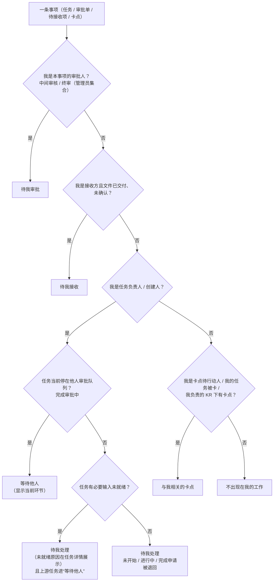

# 我的工作模块详细 PRD（V1.1）

> 版本：V1.1  
> 日期：2026-08-26  
> 状态：《协同管理工具_详细PRD_V4.5》中“我的工作”模块的已确认细化说明，可独立交付；所依赖的状态模型与规则完整收录于第 8 章  
> 规则基准：主 PRD 0.1 第 20、30 条、6、7.6、图 7-1、3.1～3.4、4.1、4.4、5.1～5.5、7.7、9.4、AC-16、AC-55；术语以 `CONTEXT.md` 为准  
> 与主 PRD 冲突时：以本文档中已经确认的“我的工作”规则为准，并同步修正主 PRD  
> 隐私原则：示例项目、人员、任务、文件必须完全虚构

---

## V1.1 修订记录（2026-08-26）

来源：2026-08-25 原型评审（主 PRD V4.5 §0.2、§0.6）。

1. **卡片减噪**：五组卡片正文统一只显示任务编号与名称、所属 KR、日期和左对齐的任务状态；原因、输入、影响、已等待天数和退回理由进入任务详情（§5、MW-21）。
2. **概况内编辑进度**：“待我处理”来源打开的本人任务可在任务概况点击进度编辑图标修改并确认（§6.1、MW-22）。
3. **交付物空态与统一上传交互**：交付物项尚无当前内容时保留该项行并显示“尚未提交交付物”；上传支持点击／拖拽、预览和提交前删除（§6.1、MW-23～24）。
4. **审批等待显示文案**：面向用户统一显示“待{当前审批人姓名}审批”，内部状态名不变（§8.2）。
5. **拒绝合入**：参考稿将本模块回退为跨项目顶层页面，并恢复“总负责人／总推进人自动兼任项目管理员”，属旧底稿分叉的意外回退，不合入；本模块维持项目内功能与 V4.4.2 角色规则（详见主 PRD §0.6）。

## V1.1.1 修订记录（2026-09-01，裁决 #162：取消入池审批）

主 PRD §0.10 裁决落地：任务创建与导入直接入池，入池审批整体取消。对本模块的影响：

1. **入池类事项全部退场**：待我审批不再有“入池审批”件；等待他人不再有“入池申请”；待我处理不再有“入池退回”任务（“草稿”“待入池审批”“入池退回”状态已删除）。
2. **输入请求通知时点前移**：输入关系建立后立即通知对接人并进入其“待我处理”，不再等待入池通过（#172 起输入源修改直接生效，无“待审批阶段”）。〔#178 后输入请求机制整体退场，本条只作历史记录〕
3. **审批超时卡点**不再对入池环节计时（该环节已不存在）。
4. **任务创建邀请**退出条件改为“通过邀请创建关联任务”（无提交入池动作）。
5. 下文各处涉及“入池”的表格与判定规则按本条修订理解；MW-04、MW-05、MW-11 相应作废或改写（见 §10）。

---

## V1.1.2 修订记录（2026-09-02，裁决 #178：输入请求机制退场）

主 PRD §0.17 裁决落地：「指定项目成员提供」改为替他人创建上游任务，输入请求机制整体退场。对本模块的影响：

1. **输入请求类事项全部退场**：待我处理不再有输入请求卡片（「输」类条目删除）；等待他人不再有「我发起的输入请求」（改为上游任务条目）；「等我提供输入」的卡点去重规则随之删除；「输入对接人」职责取消。
2. **替他人创建的上游任务是正常任务**：进入新任务负责人的「待我处理」（未开始），下游负责人的「等待他人」按上游任务条目展示，期望时间取上游任务截止日期（#174）。
3. 下文各处涉及输入请求的表格与判定规则按本条修订理解；MW-10、MW-11 作废（见 §10）。

---

## V1.1.3 修订记录（2026-09-02，裁决 10（#180）：关闭申请审批退场）

主 PRD §0.19 裁决落地：任务创建／编辑／关闭权限收归项目管理员，关闭申请审批机制整体退场（关闭为管理员直接操作：原因必填、即时生效、写任务动态）。对本模块的影响：

1. **关闭申请类事项全部退场**：待我审批不再有「关闭申请」件；等待他人不再有「我发起的关闭申请」；「关闭申请退回」的退回待处理事项删除（退回注记只剩完成申请退回一类）。
2. **审批超时卡点**不再对关闭申请环节计时（只剩成果审核、KR 终审两环节）。
3. **任务负责人职责收窄**：修改关键字段、配置输入来源／接收方不再是负责人动作（收归项目管理员）；负责人保留开始执行、更新进度、上传交付物／过程文件／外部材料、配置成果审核人、提交完成申请。
4. 下文各处涉及关闭申请的表格与判定规则按本条修订理解；MW-06 作废、MW-18 只余完成审批分支（见 §10）。

---

## V1.1.4 修订记录（2026-09-02，裁决 11（#181）：终审改项目管理员或签）

主 PRD §0.20 裁决落地：完成申请的终审人由所属 KR 负责人改为项目管理员集合（含项目负责人）或签，任一人通过即通过、退回意见必填；审批人按处理时点动态解析角色、不快照。对本模块的影响：

1. **终审件归属改变**：待终审申请进入每位项目管理员的「待我审批」（词条「KR 终审」更名「终审」）；KR 负责人不再持有终审件；任一管理员处理后其余管理员的待办自动关闭。
2. **等待他人显示文案**：待终审显示「待{首位管理员姓名}审批」，多名管理员时「待{首位姓名}等 N 人审批」；提醒目标为项目管理员集合。
3. **交接机制删除**：更换 KR 负责人不再转交未决审批、无确认框与 kr_handover 通知（审批随角色动态解析）；「项目管理员代 KR 负责人处理」兜底随之取消。
4. 下文各处「KR 终审／所属 KR 负责人终审」按本条修订理解；MW-08 改写（见 §10）。

---

## V1.1.5 修订记录（2026-09-02，裁决 12（#183）：O／KR 去负责人与周期属性）

主 PRD §0.21 裁决落地：O 与 KR 不再有负责人与周期属性，KR 负责人角色整体退场。对本模块的影响：

1. **KR 负责人视角删除**：与我相关的卡点不再含「本人 KR 下的卡点」相关性（只剩待行动人本人与任务负责人）；身份卡「当前职责」删除「KR 负责人」项。
2. **通知退场**：任务入池通知（裁决 #162 补偿机制）与任务字段修改通知（#172）因不再有接收人而删除，相应事实只留任务动态。
3. **待行动人改口径**：硬依赖互锁卡点的待行动人改为环内各任务负责人（去重）。
4. **一键提醒权限**：删除「所属 KR 负责人可提醒」分支，保留任务负责人与可编辑项目者。
5. **任务创建邀请**：发起人收归项目管理员（含项目负责人）。
6. 下文各处涉及 KR 负责人的表格与判定规则按本条修订理解。

---

## 0. 结论

“我的工作”是项目内的个人待办页，把当前项目里所有“当前轮到我、或我在等别人”的事项按 5 个固定分组推送给当前用户：**待我处理、待我审批、待我接收、等待他人、与我相关的卡点**。

- 页面不产生任何新事实：所有卡片都由任务、审批单、待接收项、卡点这 4 类既有对象按规则派生（#178 后无输入请求）；
- 用户在本页通过简洁任务卡定位事项，然后进入任务详情抽屉理解原因并完成动作；卡片只允许直接提醒，不直接改变任务、审批、输入或接收状态；
- 不提供筛选、自选排序、统计仪表盘；排序规则固定。

---

## 1. 定位与目标

### 1.1 一句话定义

以当前用户为中心、汇总其在当前项目内待行动与待等待事项的工作台；一份项目事实，身份只改变本页内容。

### 1.2 要解决的问题

- 执行者不必在总览、全部任务、卡点页之间翻找“今天该做什么”；
- 审批人（终审的项目管理员、中间审核人）不漏审、不超时；
- 接收方知道有成果待确认；
- 提交人能看到自己提交的件停在谁手里、可以提醒谁；
- 卡点落到具体的人，而不是停留在页面颜色上。

### 1.3 目标（首版）

1. 任何一个需要本人行动的事项，都能在 5 个分组之一找到，且只有一个明确的归组。（WORK-01～05）
2. 每张卡片只保留定位所需的任务编号与名称、所属 KR、日期和任务状态；原因、输入、影响和处理上下文进入任务详情查看。
3. 卡片点开一律进入统一的任务详情抽屉，按来源落到“任务概况／协作关系／审核／动态与讨论”对应 Tab，并定位、高亮本次关注对象；业务动作在抽屉内完成。
4. 五组共用一套排序，超期最前。

### 1.4 非目标

- 不做统计仪表盘、“今日概览”、完成率；
- 不做自定义分组、筛选器、自选排序；
- 不做任务的行内编辑；
- 不在卡片上直接执行通过／退回或确认接收；
- 不做人工上报卡点（主 PRD 已砍）；
- 不做跨项目聚合：“我的工作”是项目内功能，进入项目空间后按当前项目展示；多项目通过项目列表切换（V4.4.1 修订）。

---

## 2. 用户与职责

本页内容由**职责**决定，与系统权限级别无关（主 PRD 3.1、3.3）。

| 职责 | 会进入哪些分组 |
|---|---|
| 任务负责人 | 待我处理（本人任务）、等待他人（本人任务的上游、本人提交的审批件）、与我相关的卡点（本人任务被卡、本人是待行动人） |
| 任务创建人（非负责人时） | 无专属分组（裁决 #162 后无入池事项） |
| 中间审核人 | 待我审批（中间审核或签） |
| 接收方 | 待我接收（含被指定为接收方的访客）|
| 被邀请人 | 待我处理（任务创建邀请） |
| 项目管理员 | 无专属分组；仅在承担上述职责时出现。管理员免审不产生审批件 |
| 访客 | 仅在被指定为接收方时出现“待我接收”；其余各组为空 |

---

## 3. 分组定义

### 3.1 五个分组

| 分组 | 内容（主 PRD 7.6 原文口径） |
|---|---|
| 待我处理 | 责任人是本人且当前轮到本人行动的任务与请求：未开始、进行中、等待输入（带“上游未就绪”标记）及完成申请被退回待修改的任务；任务创建邀请（#178 后无输入请求） |
| 待我审批 | 本人需处理的中间审核（或签）和终审（裁决 11：本人属项目管理员集合时；裁决 10 后无关闭申请） |
| 待我接收 | 本人作为接收方需要确认接收的已交付文件 |
| 等待他人 | ① 我任务的上游：上游任务（含替他人创建的上游任务，#178）；② 我已提交、停在他人审批队列中的事项：完成申请（显示当前环节；裁决 10 后无关闭申请） |
| 与我相关的卡点 | 本人是待行动人／本人任务被卡／本人负责的 KR 下有卡点 |

### 3.2 各分组的事项来源、进入与退出条件

“事项”是卡片的最小单位。任务、审批单、待接收项、卡点是 4 类不同事项（#178 后无输入请求）；同一任务可以通过不同事项出现在多个分组（例如本人任务在“待我处理”，其任务超期卡点在“与我相关的卡点”）。同一事项只归一个分组（判定顺序见第 4 章）。

#### A. 待我处理

| 事项 | 进入条件 | 退出条件 |
|---|---|---|
| 本人负责的任务 | 任务负责人 = 本人，且页面状态 ∈ {未开始、进行中、等待输入} | 提交完成申请（转入等待他人）；已完成、已关闭；负责人变更生效 |
| 完成申请被退回的任务 | 完成申请状态 = 已退回，任务回到进行中，负责人 = 本人；退回理由保留在任务详情 | 重新提交完成申请 |
| 任务创建邀请 | 本人被项目管理员（裁决 12 后邀请权收归管理员）邀请为某 KR 下任务负责人，且尚未据此创建关联任务 | 本人通过该邀请创建至少一个关联任务，或邀请被撤回；同 KR 下无关任务不使其退出 |

#### B. 待我审批

| 事项 | 进入条件 | 退出条件 |
|---|---|---|
| 完成申请（中间审核） | 状态 = 中间审核中，本人 ∈ 中间审核组 | 本人通过／退回；或签中任一他人先通过／退回，本人待办自动关闭；任务取消 |
| 完成申请（终审） | 状态 = 待终审，本人 ∈ 项目管理员集合（裁决 11，动态解析） | 任一管理员终审通过／退回；任务关闭 |

- 关键字段修改直接生效（#172 修订）、任务关闭为管理员直接操作（裁决 10），均不产生待审批件、不出现在本组；
- 项目管理员对本人负责的任务提交完成申请时，终审件同样进入本组（终审永不豁免）；
- 裁决 11：审批人按处理时点动态解析角色——成员升降级后未决审批自动随管理员集合走，无转交与兜底机制。

#### C. 待我接收

| 事项 | 进入条件 | 退出条件 |
|---|---|---|
| 待接收项 | 任务已完成（终审通过）后系统为每位接收方生成；本人 ∈ 接收方（具体成员或“项目全体成员”）且未确认 | 本人确认接收，形成接收记录 |

接收方没有审核权，本组不提供退回。被指定为接收方的访客同样进入本组；“确认接收”是访客唯一的写操作，只登记“已取得当前交付物”的事实（主 PRD §3.3、§3.4）。

#### D. 等待他人

| 事项 | 进入条件 | 退出条件 | 卡片动作 |
|---|---|---|---|
| 上游任务 | 本人负责任务存在必要输入未就绪，来源为上游任务（未完成或已关闭；含替他人创建的上游任务，#178）；与本任务是否已开始无关 | 上游任务完成终审（输入就绪）；本任务改换来源生效 | 提醒上游任务负责人 |
| 完成申请 | 本人负责任务的完成申请状态 ∈ {中间审核中、待终审}，当前环节保留在任务详情 | 终审通过（任务已完成，退出）；退回（任务转入待我处理） | 提醒当前环节审批人（或签为全部未处理审核人，终审为项目管理员集合） |

#### E. 与我相关的卡点

| 事项 | 进入条件 | 退出条件 |
|---|---|---|
| 卡点（四类：上游未就绪、任务超期、审批超时、硬依赖互锁） | 满足任一：本人是该卡点待行动人；卡点所在任务负责人 = 本人（裁决 12 后无「所属 KR 负责人」相关性）。其中“上游未就绪”只对未开始的任务派生，任务一旦进入进行中即自动解除（主 PRD §4.4 第 7 条） | 卡点触发条件消失即自动解除（历史进任务动态） |

（#178 后无「等我提供输入」去重规则：输入请求机制已退场，上游未就绪卡点的待行动人一律为上游任务负责人。）

---

## 4. 归组判定规则

### 4.1 判定顺序（主 PRD 图 7-1）

对每一条事项，按以下顺序判定，命中即停止：

### 4.2 补充规则

2. 已提交完成申请、审批中的本人任务只在等待他人，不在待我处理。
3. 被退回事项（完成申请退回，裁决 10 后无关闭申请）回到提交人的待我处理，退回理由在任务详情中定位展示。
4. 等待输入的本人任务归待我处理，不归等待他人；其上游作为独立事项进等待他人。
5. 或签：完成申请在中间审核中时，每位中间审核人各有一条待办；任一人处理后其余待办自动关闭并从待我审批消失。
6. 任务关闭（裁决 10：管理员直接操作）：未决审批单自动关闭，相关卡片全部消失；下游任务对应输入标为“上游未就绪：来源已关闭”，该原因在下游任务详情中展示。
7. 卡点由系统派生、自动解除，本页不提供“解除”“上报”动作。
8. 只有未就绪的必要输入或硬前置关系进入“等待他人”；参考输入未就绪只在任务概况中提示，不生成本页事项或计数。

---

## 5. 卡片规范

### 5.1 信息边界

五个 Tab 的卡片正文统一只显示任务编号与名称、所属 KR、日期和任务状态。卡片不展开“为什么轮到我、需要什么输入、完成后影响谁”等说明，这些信息进入任务详情查看。

### 5.2 统一字段（五组共用）

| 字段 | 规则 |
|---|---|
| 任务编号与名称 | 必显；审批、输入、接收、卡点等事项仍以所属任务作为卡片主体 |
| 所属 KR | 必显 |
| 日期 | 必显；任务显示截止日期，审批和接收事项显示所属任务截止日期 |
| 任务状态 | 必显；使用固定宽度状态列并左对齐，文案与全站任务状态一致 |
| 项目标识 | 不显示；“我的工作”为项目内功能，项目上下文由当前所在项目确定 |

卡片不显示负责人头像、进度条、已等待天数、原因摘要、输入摘要、影响对象或退回理由；这些统一进入任务详情。超期仅通过卡片侧边强调和日期语义表达，不增加额外正文。

### 5.3 各类卡片的落点与动作

| 卡片类型 | 打开后的默认落点 | 卡片允许的直接动作 |
|---|---|---|
| 本人任务 | 任务概况，定位当前待处理项 | “去处理”文字按钮 |
| 中间审核、终审 | 审核，定位当前审批单 | “去处理”文字按钮 |
| 待接收项 | 任务概况，定位当前交付物与接收区 | “去处理”文字按钮 |
| 等待他人 | 任务概况，定位当前环节或未就绪输入 | 无文字按钮（点条目行打开抽屉）；可直接提醒 |
| 卡点 | 任务概况，定位结构化卡点及影响 | 无文字按钮（点条目行打开抽屉）；可直接提醒 |

- 卡片主体和“去处理”入口一律打开任务详情抽屉；只读组（等待他人、卡点）不设“查看详情”按钮，点条目行即打开（#168 调整，#14 反馈）；除提醒外，卡片不直接改变任何业务状态；“提醒”按钮任何宽度下单行展示、不折行；
- 所有退回动作必填一句话理由，理由随站内通知带给提交人并进任务动态；通过不填理由；
- 一键提醒：自动带入任务、缺失输入、截止时间和下游影响；提醒频次上限按（发起人、被提醒人、任务）三元组计当天次数，默认每天 1 次，阈值取项目规则设置；不提醒本人。

### 5.4 超期判定

| 事项 | 超期标红条件 |
|---|---|
| 任务 | 截止时间已过且未完成 |
| 审批件 | 当前审批环节等待达到审批超时阈值 N×24 小时（默认 N=3）；进入新审批环节后重新计时，与“审批超时”卡点同口径 |
| 待接收项 | 不判定超期 |
| 卡点 | 按所在任务判定 |

---

## 6. 详情交互

### 6.1 载体

五个分组的卡片点开一律打开**任务详情抽屉**（右侧抽屉，与全部任务、关系列表等页面共用同一抽屉），不新建独立页面或弹窗；弹窗只用于输入型动作（退回理由、提交输入内容、上传文件名、完成申请勾选）。

任务详情抽屉固定使用以下四个 Tab，本页只负责自动落位，不改变结构：

- **任务概况**：按基础信息、输入源、交付物、交付物接收方、当前卡点五块固定顺序展示，并提供当前用户有权执行的任务、输入、交付物和接收动作；
- **协作关系**：直接上游与直接下游两组，以及进入关系图谱聚焦本任务的入口，只读；
- **审核**：完成申请、候选交付物和或签链，只对当前待行动审核人提供通过／退回（裁决 10 后无关闭申请）；
- **动态与讨论**：上段是只读倒序的任务动态（默认最近 5 条，可展开全部），下段是正序的讨论意见与输入框，所有项目内成员可查看和提交文字意见及 @，不承载业务状态变更。

任务概况遵循全站统一规则：负责人、参与人、周期、执行状态、进度、量化标准、可选任务说明依次展示（#175 互换）；无输入源、无交付物项且无配置权限、无接收方或无卡点时，对应区块不显示；交付物项尚无当前内容时该项显示“尚未提交交付物”。协作关系为空时 Tab 常驻并显示空态。待我处理中的本人任务可通过进度后的编辑图标进入编辑态并确认；其他来源只读。

上传文件统一支持点击或拖拽选择；已选文件名可点击预览，并可在正式提交前删除。文件只有提交成功后才成为其他人可预览、下载的交付物。

### 6.2 按分组叠加的差异

| 来源分组 | 抽屉差异 |
|---|---|
| 待我处理 | 进入“任务概况”，滚动定位当前待处理内容；被退回任务定位并短暂高亮退回理由 |
| 待我审批 | 进入“审核”，定位并短暂高亮当前审批单；通过／退回只在该 Tab 内提供 |
| 待我接收 | 进入“任务概况”，定位并短暂高亮交付物和交付物接收方区块 |
| 等待他人 | 进入“任务概况”，定位输入源区块中未就绪的必要输入，只读查看；提醒可在卡片直接执行 |
| 与我相关的卡点 | 进入“任务概况”，定位并短暂高亮末尾的当前卡点区块；协作关系已独立成 Tab，一次落位只命中一个 Tab；提醒可在卡片直接执行 |

### 6.3 动作完成后的行为

- 动作生效后卡片按第 3 章退出条件立即从当前分组移除或迁移；Tab 计数徽标同步刷新；
- 抽屉保持打开，显示动作结果与最新状态；
- 所有动作进入任务动态。

---

## 7. 排序与页面层

### 7.1 排序（五组共用，固定）

1. 超期（标红）最前；
2. 今天到期；
3. 其余按截止／期望时间升序；
4. 无时间字段的事项按已等待时长降序（越久越前）；
5. 被阻塞（存在未就绪的必要输入）的事项先把紧急度加一档，再按 1～4 排；即“阻塞”参与紧急度计算，而不是在同层级内额外排到末尾。本条适用于五组中承载任务的卡片（待我处理的本人任务、等待他人的上游任务、与我相关的卡点）；审批件、待接收项、任务创建邀请不适用。

不提供用户自选排序，不提供筛选器。

### 7.2 页面层

- 顶部：身份说明（当前用户姓名、项目内系统权限、承担的职责摘要）；
- 5 个 Tab，每个 Tab 带计数徽标；默认落在待我处理；
- Tab 内为卡片列表；空组显示一句话空态；
- 卡片状态列固定宽度并左对齐；所有操作使用文字按钮，不使用占空间的实心操作按钮；
- 不加统计仪表盘、“今日概览”、完成率；
- 卡片不带项目标识；“我的工作”为项目内功能，随项目切换。

---

## 8. 数据依赖

本页不落库，全部由下列对象与派生规则实时计算。本章完整给出模块交付所需规则；与主 PRD 的“我的工作”表述冲突时，以本文档已确认规则为准并同步主 PRD。

### 8.1 依赖对象与字段

| 对象 | 定义 | 本页用到的字段 |
|---|---|---|
| 项目 | 组织多个 O 的协作空间 | 名称、规则设置（审批超时阈值、临期阈值、提醒频次上限） |
| KR | 衡量 O 的关键结果 | 描述、量化指标、创建人（裁决 12：无负责人与周期） |
| 任务 | KR 下最小管理单元 | 名称、所属 KR、创建人、负责人、开始／截止时间、页面状态、进度、接收方（一至多名成员或“项目全体成员”）、中间审核人列表、量化指标 |
| 输入要求 | 任务所需的上游结果或信息 | 来源任务（#178 后无成员来源）、必要性（#173 后无关系类型）、就绪状态 |
| 交付物文件 | 挂在任务上的文件或内容 | 所属任务、文件名、提交人、时间、状态 |
| 完成申请 | 基于本次交付物文件的完成请求 | 任务、交付物文件列表、提交人、中间审核组、状态、提交时间（终审人为项目管理员集合，裁决 11） |
| 中间审核组 | 完成申请上的可选或签节点 | 审核人列表、状态、首个有效动作人、意见、时间 |
| 待接收项／接收记录 | 接收方确认取得已交付文件的事实 | 接收方、任务、生成时间、确认时间 |
| 卡点 | 系统派生的阻塞事实 | 类型、所在任务、待行动人、产生时间、影响范围 |
| 任务创建邀请 | 项目管理员邀请某人在指定 KR 下创建任务的行动请求（裁决 12） | KR、被邀请人、发起人、时间、状态、后续任务的关联邀请标识 |
| 提醒记录 | 一键提醒事实 | 发起人、被提醒人、任务、时间、内容（频次上限按发起人＋被提醒人＋任务计当天次数） |
| 项目成员 | 成员在项目内的身份 | 姓名、系统权限级别（项目管理员／成员／访客）、承担的职责 |

### 8.2 任务页面主状态

| 状态 | 定义 | 触发动作 | 本页归组（负责人视角） |
|---|---|---|---|
| 未开始 | 创建即进正式池，尚未开始（裁决 #162） | 创建或导入 | 待我处理 |
| 等待输入 | 纯显示派生态（裁决 13，#182）：必要输入未就绪且任务未开始时叠加，不落库；任务开始后不再叠加 | 派生 | 待我处理（未就绪原因在任务详情展示） |
| 进行中 | 负责人已开始 | 点击开始 | 待我处理 |
| 审核中 | 已提交完成申请；当前环节（中间审核／终审）从完成申请单读取（裁决 13） | 提交完成申请 | 等待他人（显示当前环节） |
| 已完成 | 终审通过（项目管理员或签，裁决 11） | 终审通过 | 不出现 |
| 已关闭 | 不再执行，保留原因 | 项目管理员直接关闭（裁决 10：原因必填、即时生效） | 不出现 |

- 主线：未开始 → 进行中 → 审核中 → 已完成（裁决 #162 创建即入池；裁决 13 存储五态，等待输入只是显示叠加）；
- 等待输入是只在“未开始”上叠加的状态，输入全部就绪或任务开始后自动恢复底层状态；必要输入未就绪在任何阶段都不拦开始、上传文件、提交完成申请；
- 审核中被退回后任务一律回到进行中（不区分从哪个环节退，裁决 13）；
- 已完成、已关闭为终态，不可重开、不可恢复；
- 关闭权限（裁决 10）：仅项目管理员（含项目负责人），必填原因、即时生效、写任务动态；有未决审批单时不可关闭；
- 关键字段修改直接生效（#172 修订；裁决 10 收归项目管理员），不改变任务页面状态；
- 审批等待状态的内部状态名仍用于规则判断；卡片和任务详情面向用户统一显示“待{当前审批人姓名}审批”，例如“待周宁审批”。

### 8.3 审批状态

#### A. 入池审批单（已取消，裁决 #162）

创建入池审批整体取消，无审批单、免审记录与相关待办；补偿机制为入池写任务动态（原入池通知随 KR 负责人角色退场删除，裁决 12）。

#### B. 关键字段修改（审批已取消，#172 修订）＋任务关闭（裁决 10，#180）

关键字段：标题、描述、量化指标、任务负责人、开始／截止时间、输入来源、接收方。项目管理员（含项目负责人）直接修改立即生效，无修改原因；动作进任务动态（原字段修改通知随 KR 负责人角色退场删除，裁决 12）。中间审核人调整不是关键字段（负责人保留配置权），直接生效并留痕的口径不变。

任务关闭（裁决 10：关闭申请审批退场）：项目管理员直接操作，原因必填、即时生效、写任务动态；任务上有未决审批单时不可关闭。无审批单、无退回，本模块不产生任何关闭类事项。

#### C. 完成申请

| 完成申请状态 | 任务页面状态 | 交付物文件状态 | 当前待行动人 |
|---|---|---|---|
| 未提交 | 未开始／进行中 | 待提交 | 任务负责人 |
| 中间审核中 | 审核中（环节：中间审核，读申请单） | 审核中 | 全部中间审核人（或签） |
| 待终审 | 审核中（环节：终审，读申请单） | 待终审 | 项目管理员集合（或签，裁决 11） |
| 已退回 | 进行中 | 已退回 | 任务负责人 |
| 已通过 | 已完成 | 已交付 | 接收方（确认接收） |

或签规则：
- 中间审核人 0～多名；0 名时提交后直接待终审；
- 多人时任一人首先通过，完成申请进入待终审，其余人待办自动关闭；任一人退回，整体退回，其余人待办自动关闭；
- 通过与退回记录处理人、时间；退回必填一句话理由；
- 退回后任务回到进行中，文件解锁，负责人修改后重新提交完整流程；
- 终审由项目管理员集合或签执行（裁决 11）：任一人通过即通过、退回意见必填；或签组内含管理员时，管理员在或签环节通过即视同终审通过（裁决 C2 改写）。

### 8.4 交付物文件状态

| 状态 | 定义 | 可否覆盖 |
|---|---|---:|
| 待提交 | 已上传未随完成申请提交 | 可 |
| 审核中 | 已随完成申请提交，等待中间审核 | 锁定 |
| 已退回 | 完成申请被退回，文件保留可修改 | 可 |
| 待终审 | 中间审核已通过，等待终审 | 锁定 |
| 已交付 | 终审通过（项目管理员或签） | 永久锁定 |

只有“已交付”文件可被接收方确认接收、可使下游必要输入就绪。同名文件覆盖上传，不保留旧文件本体，无版本管理。

### 8.5 输入就绪（#178 后无输入请求状态）

裁决 #178：输入请求机制退场，本节原三态表（待接收／已接收／已提供）删除。无匹配来源任务时替指定成员创建上游任务（主 PRD §7.5／§8.2），新任务负责人收到「被指定为负责人」通知并按正常任务进入其待我处理。

- 输入就绪判定：来源任务状态为已完成（其文件已交付）即就绪（#178 后来源一律为任务）；
- 必要输入未就绪 → 任务显示等待输入；参考输入未就绪只提示；
- 上游任务被关闭时，下游对应输入标为“上游未就绪：来源已关闭”并通知下游负责人，由项目管理员更换来源（裁决 10）；
- 更换上游任务属于关键字段修改，直接生效并留痕。

### 8.6 接收方与待接收项

- 接收方是任务可选字段：一至多名具体成员或“项目全体成员”（#171 改词，旧称“所有项目成员”）；
- 任务终审通过（已完成）时，系统为每位接收方生成一条待接收项；“项目全体成员”按当时项目成员逐人生成；
- 接收方确认后形成接收记录，待接收项退出；
- 接收方没有审核权，不能退回。

### 8.7 四类卡点

| 卡点 | 触发 | 待行动人 | 解除 |
|---|---|---|---|
| 上游未就绪 | 必要输入未就绪且任务已到开始时间 | 上游任务负责人 | 输入就绪 |
| 任务超期 | 截止已过且未完成 | 任务负责人 | 完成或改期生效 |
| 审批超时 | 审批单在当前环节等待达到 N×24 小时；进入新环节重新计时 | 该审批人（或签为各中间审核人） | 审批处理或审批单关闭 |
| 硬依赖互锁 | 硬前置交付边成环 | 环内各任务负责人（裁决 12 修订） | 任一边被改掉 |

- 卡点全部系统派生，没有人工上报、协调人、手动解除；触发条件消失即自动解除，历史进任务动态；
- 未到开始时间的输入缺失、临期、审批等待未超阈值为风险信号，不生成卡点，不进本页。

### 8.8 规则设置

在项目设置的独立“规则设置”页维护，仅项目管理员可改，按项目生效，不做成员级个性化（主 PRD §7.9）。

| 配置项 | 默认值 | 本页用途 |
|---|---|---|
| 审批超时阈值 N | 3 天 | 审批超时卡点；审批件超期标红 |
| 临期阈值 | 3 天 | 不用于本页（只进风险等级派生与报告） |
| 一键提醒频次上限 | 同一发起人对同一被提醒人的同一任务每天 1 次 | 等待他人与卡点组的提醒动作 |

一键提醒自动带入任务、缺失输入、截止时间和下游影响；不能提醒本人；提醒作为站内通知送达被提醒人。

站内通知触发点固定：完成审批待办／退回／终审通过、任务创建邀请、被指定为上游任务负责人（#178）、上游任务已完成（通知下游）、一键提醒（裁决 10 后无关闭申请类通知；裁决 12 后无入池与字段修改通知）。

### 8.9 职责与系统权限

系统权限只有三级；职责按对象指派，与权限级别无关。

| 权限级别 | 能力边界 |
|---|---|
| 项目管理员 | 管理结构、成员、配置；修改任意任务关键字段（#172 修订：直接生效）；终审人（裁决 11）；不能替代中间审核人 |
| 成员 | 查看完整项目，创建任务，处理本人承担的职责动作 |
| 访客 | 只看，不改变项目事实 |

| 职责 | 决定的动作 |
|---|---|
| 任务负责人 | 开始、更新进度、配置中间审核人、上传交付物文件、提交完成申请（裁决 10：修改关键字段与配置输入来源／接收方收归项目管理员，关闭申请退场） |
| 中间审核人 | 或签通过／退回 |
| 接收方 | 确认接收 |

（裁决 12，#183：KR 无负责人，「KR 负责人」职责整行删除。）

项目字段“项目负责人”指向的人享有与项目管理员同等的权限，但负责人与管理员是两个独立角色，负责人不自动成为管理员（主 PRD §0.4 V4.4.2 修订）。

### 8.10 派生规则汇总

| 派生结果 | 输入 | 规则 |
|---|---|---|
| 分组归属 | 事项 + 本人职责 | 第 4 章判定顺序 |
| Tab 计数徽标 | 该组事项 | 事项数 |
| 已等待天数 | 当前审批环节进入时间、当前时间 | 当前时间 − 起始时间，按完整 24 小时折算 |
| 超期标红 | 截止时间、N | 第 5.4 节 |
| 上游未就绪标记 | 输入要求就绪状态 | 任一必要输入未就绪即显示，XX 取未就绪的上游任务名 |
| 当前环节 | 完成申请状态 | 中间审核中 → “中间审核”；待终审 → “终审”（裁决 11） |
| 排序 | 超期、截止／期望时间、已等待天数、阻塞标记 | 第 7.1 节 |
| 提醒可用性 | 提醒记录、频次上限 | 同一人对同一任务当天已提醒则不可用；被提醒人 = 本人时不可用 |

---

## 9. 通知联动

站内通知触发点固定（主 PRD 9.4）。与本页相关的通知点开后进入对应任务详情抽屉，落点与从本页进入一致：

| 通知 | 对应本页事项 |
|---|---|
| 任务入池（裁决 #162；裁决 12 后无通知） | 无对应事项；入池留痕在任务动态 |
| 任务字段修改（#172 修订；裁决 12 后无通知） | 无对应事项；修改留痕在任务动态 |
| 完成审批待办／退回／终审通过 | 待我审批／待我处理／待我接收（接收方） |
| 被指定为上游任务负责人（#178） | 待我处理（新任务负责人的本人任务） |
| 上游任务已完成 | 待我处理（下游任务标记消失） |
| 一键提醒 | 被提醒人对应的分组 |

---

## 10. 权限

- 本页对所有登录用户可见；内容只取决于本人承担的职责；
- 访客除“被指定为接收方”外无职责，其余各组为空；被指定时“待我接收”有内容，确认接收是其唯一写操作；
- 卡片与抽屉中的动作权限按 8.9 职责表：通过／退回只对该审批件的审批人显示；确认接收只对接收方显示（含访客）；提醒对项目管理员与成员开放，访客不可。

---

## 11. 非功能要求

- 桌面端为主要环境；移动端至少支持本页浏览、通知查看，并可进入任务详情完成简单确认（通过／退回、确认接收）；
- 计数徽标与列表在动作后即时刷新，不整页重载；
- 单人事项数在 200 条以内时列表无感知延迟；超出时分组内分页或虚拟滚动；
- 所有状态同时提供文字，不只依靠颜色；红色只用于超期与真实阻塞；
- 视觉延续浅色、中高密度的低噪声风格；辅助文字 12px、正文 14px、页面／抽屉主标题 16px，通用圆角 4px；字体 `system-ui, PingFang SC, Segoe UI, Microsoft YaHei, sans-serif`；UI 显示中文姓名。

---

## 12. 范围边界

### 12.1 首版必须具备（P0）

- 5 个分组、判定顺序、去重规则；
- 卡片统一只显示任务编号与名称、所属 KR、日期和任务状态；
- 卡片只保留“去处理”（本人要办的三组）和允许直接执行的提醒，不直接改变业务状态；只读组点条目行打开抽屉（#168 调整）；
- 点开进入“任务概况／协作关系／审核／动态与讨论”四 Tab任务详情，并按分组自动落位、滚动定位和短暂高亮；
- 固定排序、Tab 计数徽标、身份说明；
- 与站内通知的落点一致。

### 12.2 后续（P1）

- 多项目真实汇总与项目筛选；
- 企业微信、邮件等外部渠道推送本页事项；
- 移动端长图或摘要推送。

### 12.3 明确不做

- 自定义分组、筛选器、自选排序、统计仪表盘；
- 卡片上的行内编辑；
- 人工上报卡点、手动解除；
- 待我终审单独分组（已并入待我审批）。

---

## 13. 验收场景

使用完全虚构的演示数据。以下场景细化主 PRD AC-16，并复用相关 AC。

| 编号 | 场景 | 通过标准 |
|---|---|---|
| MW-01 | 任务负责人视角 | 本人未开始／进行中／等待输入任务出现在待我处理，对应上游任务出现在等待他人；未就绪原因进入任务详情，不在卡片展开 |
| MW-02 | 提交完成申请后 | 该任务从待我处理消失，出现在等待他人并显示当前环节（中间审核／终审） |
| MW-03 | 完成申请被退回 | 任务回到待我处理，等待他人中的对应条目消失；打开详情后定位并高亮退回理由 |
| MW-04 | 创建任务（裁决 #162 修订；裁决 12 后无入池通知） | 创建后任务直接进入负责人的待我处理（未开始／等待输入）；不产生任何入池审批件或等待事项 |
| MW-05 | 入池退回（已作废，裁决 #162） | 入池审批已取消，无退回场景 |
| MW-06 | 关闭申请（已作废，裁决 10 #180） | 关闭申请审批机制退场：关闭为项目管理员直接操作，本模块无关闭类事项 |
| MW-07 | 中间审核或签 | 多名中间审核人的待我审批各有一条；任一人通过后其余人的条目消失，各项目管理员的待我审批出现终审件（裁决 11） |
| MW-08 | 终审（裁决 11 改写） | 终审件在每位项目管理员（含项目负责人）的待我审批，任一人处理后其余待办关闭；打开后进入“审核”Tab并高亮本次交付物与或签链；普通成员看不到该件 |
| MW-09 | 终审通过后 | 每位接收方（含“项目全体成员”）的待我接收出现待接收项；卡片进入“任务概况”查看交付物后确认接收，确认后消失并形成接收记录 |
| MW-10 | 替他人创建上游任务（已作废原「输入请求」场景，#178 修订） | 替指定成员创建上游任务后，新任务直接进入其负责人的待我处理（未开始），负责人收到「被指定为负责人」通知；下游负责人的等待他人出现该上游任务条目 |
| MW-11 | 输入请求（已作废，#178 修订） | 输入请求机制整体退场，无对应场景 |
| MW-12 | 卡点（裁决 12 修订） | 任务超期卡点出现在任务负责人的卡点组；审批超时卡点出现在审批人卡点组 |
| MW-13 | 一键提醒 | 等待他人与卡点组可提醒当前待行动人；同一发起人对同一被提醒人的同一任务当天第二次提醒被拒，换一个被提醒人不受影响；不能提醒本人 |
| MW-14 | 任务取消 | 取消后该任务相关的审批件、卡点卡片全部消失；下游负责人任务仍按规则归组，来源取消原因在详情展示 |
| MW-15 | 排序 | 被阻塞事项先加一档紧急度，再按超期、今天到期、时间升序、等待时长降序排列 |
| MW-16 | 身份切换 | 切换身份后项目事实不变，5 组内容与计数随职责变化；访客除被指定为接收方时的“待我接收”外各组为空 |
| MW-17 | 抽屉落点 | 从 5 组任一卡片点开都进入“任务概况／协作关系／审核／动态与讨论”四 Tab任务详情并按来源落位；卡片除提醒外不直接改变业务状态 |
| MW-18 | 退回必填理由 | 任何退回动作未填理由不能提交；理由出现在提交人卡片与任务动态 |
| MW-19 | 任务创建邀请（裁决 #162 修订） | 只有通过该邀请创建至少一个关联任务，或邀请被撤回时退出；同 KR 下无关任务不使邀请退出 |
| MW-20 | 审批超时 | 当前审批环节等待达到 N×24 小时后审批件标红并生成审批超时卡点；进入新环节重新计时，处理或关闭后卡点解除 |
| MW-21 | 卡片减噪 | 五个 Tab 的卡片只显示任务编号与名称、所属 KR、日期和左对齐的任务状态；原因、输入和影响仅在详情中出现 |
| MW-22 | 待我处理进度 | 本人待处理任务可点击进度后的编辑图标进入编辑态并确认；其他来源不可编辑 |
| MW-23 | 交付物空态 | 交付物项存在但尚无当前内容时，该项行保留并显示“尚未提交交付物”，不隐藏整个区块；没有任何交付物项且无配置权限时才不显示交付物区域；提交成功后才允许项目成员预览和下载 |
| MW-24 | 上传交互 | 支持选择或拖拽文件、点击文件名预览、提交前删除；关闭窗口不保留未提交选择 |

---

## 14. 已确认的模块决策

1. 卡片不直接执行通过／退回或确认接收；所有改变业务状态的操作进入任务详情完成，提醒可以直接执行。
2. 任务详情固定为“任务概况／协作关系／审核／动态与讨论”四个 Tab，并按来源分组自动落位、滚动定位和短暂高亮。
3. 只有未就绪的必要输入进入“等待他人”；参考输入仅在任务概况提示。
4. 任务创建邀请只在通过该邀请创建关联任务，或邀请被撤回时退出（裁决 #162 修订）。
5. 关键字段变更退回提示只在重新提交、明确放弃或任务终止后退出，查看不清除。
6. 审批超时按当前审批环节独立计时，达到项目阈值 N×24 小时即超时；N 在项目规则设置页配置，默认 3 天，进入新环节重新计时。
7. 五个 Tab 的卡片只承担定位，不展开原因、输入和影响；任务状态固定左对齐。
8. 待我处理中的本人任务允许编辑进度；完成终审通过后进度自动置 100% 并锁定编辑（主 PRD §5.6）。
9. 必要输入未就绪不阻断任何动作，“等待输入”只在未开始阶段叠加；任务开始后“上游未就绪”卡点自动解除，但“等待他人”条目保留以便继续提醒上游。

---

## 15. 需求追溯

| 需求 | 本文件落点 | 验收 |
|---|---|---|
| WORK-01 | 1、3、7 | MW-01、16 |
| WORK-02 | 3.2 A、5.3 | MW-10、11 |
| WORK-03 | 3.2 B、6.2 | MW-04、06、07、08 |
| WORK-04 | 3.2 D、5.3 | MW-01、02、10 |
| WORK-05 | 3.2 E、5.3 | MW-12、13 |
| WORK-08、09 | 5、6、9 | MW-03、05、13、17 |
| INOUT-03 | 3.2 A、5.3 | MW-10 |
| APPR-02、03、06 | 3.2 B、4.2 第 5 条 | MW-07、08、18 |
| ROLE-05、ROLE-07 | 2、10 | MW-16 |
| 主 PRD AC-16 | 全文 | MW-01～24 |
| 主 PRD AC-55 | 5、7.2 | MW-21 |
